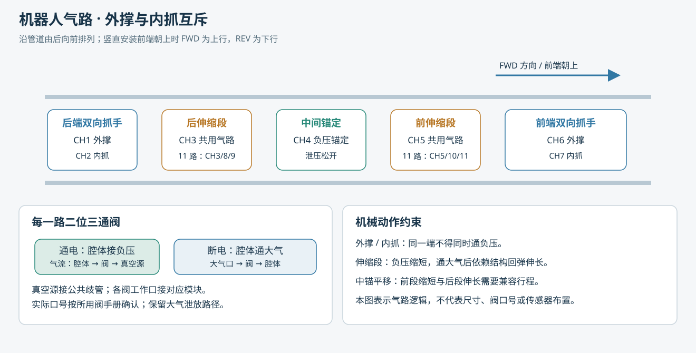
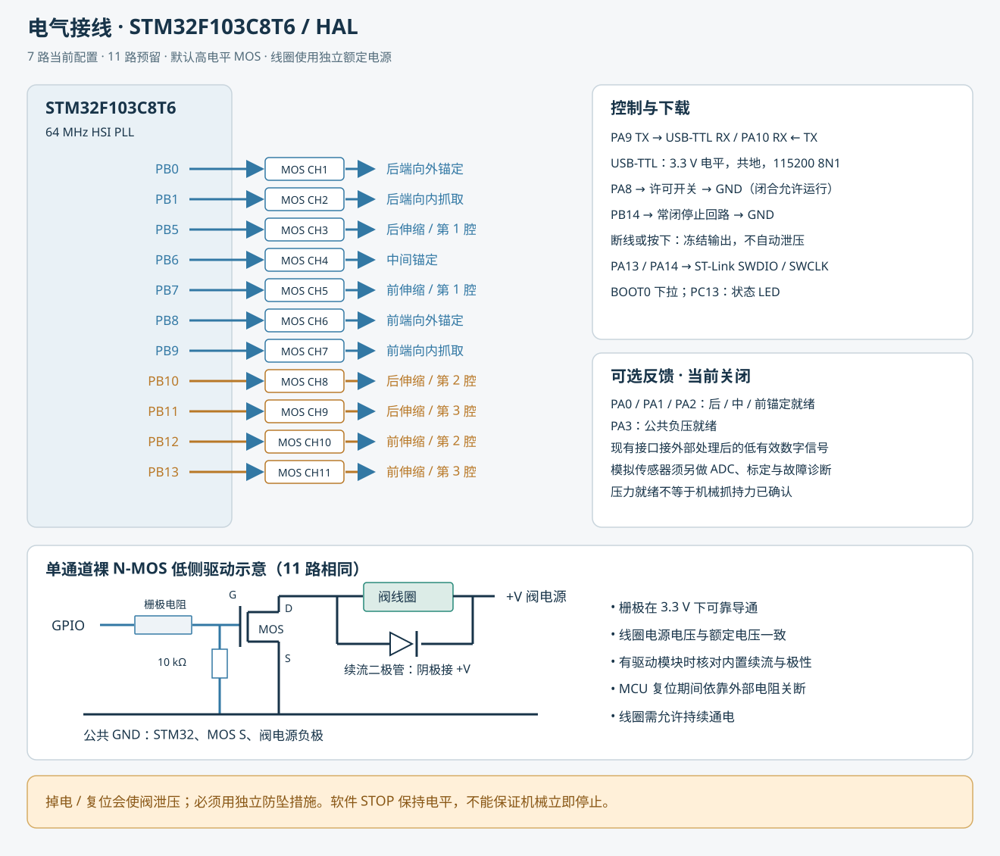
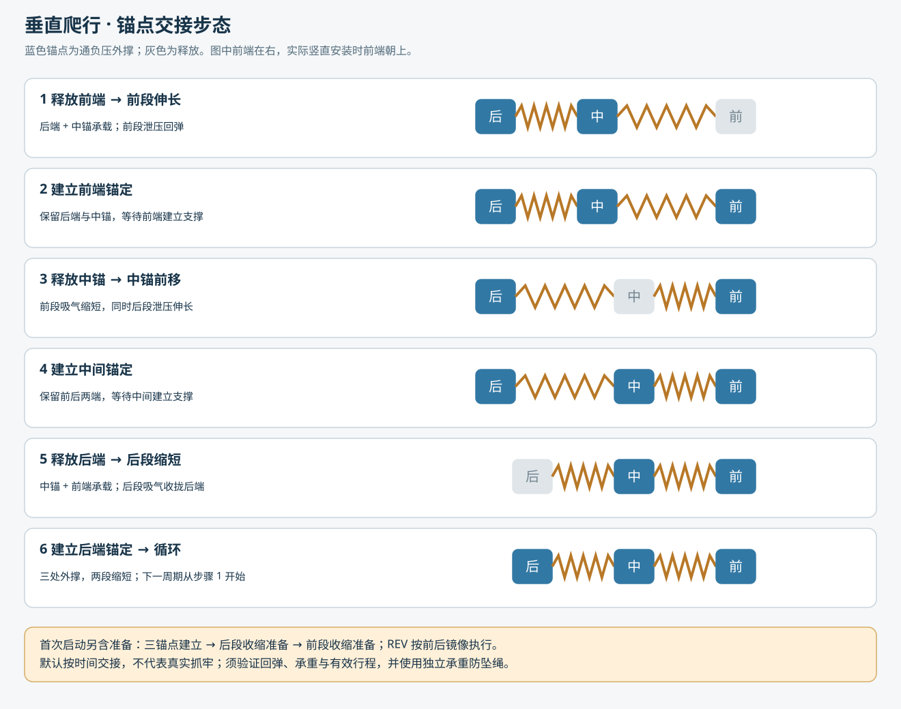

# STM32F103C8T6 蠕虫机器人 HAL 控制器

7 路二位三通电磁阀：通电接负压，断电通大气。串口控制前进、后退、端部向内抓取及向外锚定。提供 11 路编译目标，两个伸缩模块扩展后三个腔可独立点动，直行时同步驱动。

**工程默认锁定执行器。** 两个随附 HEX 的 `APP_HARDWARE_CONFIRMED=0`，可用于串口和输入检查，`ARM` 不会成功。完成下述台架检查后，将 [AppConfig.h](User/AppConfig.h) 的该配置设为 `1`，重新构建。启动还需要 PA8 许可、PB14 常闭停止回路与串口 `ARM`；不会上电自走。

本交付已验证软件构建、状态机和输出映射；**未烧录实机，未验证真实抓力、行程、负压或垂直爬行效果**。定时步态不等于抓牢确认。首轮必须使用承重防坠绳、限位和人工托持；中断负压、掉电及看门狗复位会使本型阀泄压，软件不能保证防坠。

## 直接打开与构建

- 打开 `Project.uvprojx`，芯片 STM32F103C8，64 KB Flash、20 KB RAM。
- `Worm7_Locked`：当前七路，默认目标；`Worm11_Locked`：十一气路扩展。
- 本机已使用 Keil ARMCC 5.06 update 5 构建。HAL/CMSIS 依赖均在工程内，版本见 `docs/vendor-manifest.json`。不依赖另一份气泵工程。
- 系统时钟采用内部 HSI/2 × 16 = 64 MHz；APB1 32 MHz，APB2 64 MHz，SysTick 1 ms。串口 HSI 温漂和误差需要在实机环境验证。
- `tools/build.ps1` 全量构建两个目标；`tools/test.ps1` 执行桌面 C 测试；`tools/check_enabled.ps1` 独立编译解锁配置且不生成 HEX；`python -X utf8 tools/validate_project.py` 检查工程、厂商文件哈希及 HEX。
- 默认 HEX 分别位于 `Objects/Worm7_Locked/Worm7_Locked.hex`、`Objects/Worm11_Locked/Worm11_Locked.hex`。
- `Locked` 是默认工程名；修改解锁宏后请另存、重命名生成的 HEX，并以实际 `STATUS` 的 LOCK 值为准。
- ST-Link：PA13 SWDIO、PA14 SWCLK、GND、3V3 参考、可选 NRST；BOOT0 下拉。请按板卡实际供电方式连接，避免两个电源相互灌电。

## 通道和接线

“前端”是软件定义的 FWD 方向。竖直安装时将前端朝上，FWD 对应上行，REV 对应下行。两端的外撑回路在上行、下行时都用于锚定，内抓回路不参与爬行。

| 通道 | GPIO | 气动负载 | 位图十进制值 |
|---|---|---|---:|
| CH1 | PB0 | 后端向外锚定 | 1 |
| CH2 | PB1 | 后端向内抓取，与 CH1 互斥 | 2 |
| CH3 | PB5 | 后伸缩，7 路模式三折纸共用 | 4 |
| CH4 | PB6 | 中间负压锚定 | 8 |
| CH5 | PB7 | 前伸缩，7 路模式三折纸共用 | 16 |
| CH6 | PB8 | 前端向外锚定 | 32 |
| CH7 | PB9 | 前端向内抓取，与 CH6 互斥 | 64 |
| CH8 | PB10 | 扩展：后伸缩第 2 腔 | 128 |
| CH9 | PB11 | 扩展：后伸缩第 3 腔 | 256 |
| CH10 | PB12 | 扩展：前伸缩第 2 腔 | 512 |
| CH11 | PB13 | 扩展：前伸缩第 3 腔 | 1024 |

| 其他引脚 | 功能 |
|---|---|
| PA9 / PA10 | USART1 TX / RX；接 USB-TTL RX / TX，115200、8N1、3.3 V |
| PA8 | 物理运行许可开关，接 GND 才许可，内部上拉 |
| PB14 | 常闭停止回路，正常接 GND，按下或断线为高；软件冻结输出 |
| PC13 | 常见开发板低有效 LED，运行常亮，其他状态闪烁 |
| PA0 / PA1 / PA2 | 可选后/中/前锚定反馈接口，默认未启用 |
| PA3 | 可选公共负压就绪反馈接口，默认未启用 |

MOS 默认 **3.3 V 高电平触发**。购买或使用模块前确认输入阈值、负载电压和持续电流。低有效模块需改 `APP_MOS_ACTIVE_HIGH=0`，将每个信号的外部下拉改为合适的上拉，并验证复位期输出。不要把 5 V 上拉接到不合适的 MCU 引脚。

裸 N 沟道低侧驱动：GPIO 经栅极电阻至 G，G-S 加约 10 kΩ 下拉，S 接电源地，D 接线圈负端，线圈正端接额定电源；线圈反并续流二极管（阴极接正电源）。器件须在 VGS=3.3 V 有额定导通参数。已有模块则核对是否内置驱动/续流保护。逻辑地与阀电源地共地，阀不得由 MCU GPIO 或 3.3 V 供电。线圈需满足持续通电工况；持续 HOLD 可能长时间通电。

## 串口操作

推荐控制台：`python -X utf8 tools/serial_console.py COM3`，需要 `pyserial`。控制台每秒发 `PING`，不会自动 `ARM`。普通串口助手也可用，但须配置每秒发送 `PING`；五秒未收到心跳会在 ARMED/运动/抓取/点动状态锁存故障并冻结输出。任意命令或 STATUS 不能代替心跳。

命令为严格大写 ASCII，每行 CR、LF 或 CRLF 结束；无额外空格。接受返回 `OK`，拒绝返回 `ERR ...`；`OK` 仅说明接受，动作完成需查询状态。

| 命令 | 行为 |
|---|---|
| `STATUS` | 状态、故障、相位、位图、周期数、锁定/反馈配置和输入 |
| `PING` | 更新通信心跳，不启动、不清除故障 |
| `ARM` | 仅 IDLE 且编译解锁、物理许可、停止回路正常时进入 ARMED |
| `RUN FWD 1` | 向前运行 1 个周期；数字范围 1～1000 |
| `RUN REV 1` | 向后运行 1 个周期；不得在运动中直接换向 |
| `GRIP FRONT IN` / `GRIP REAR IN` | 指定端向内抓取；先建立另两处支撑，再释放目标端外撑，延时后内抓 |
| `GRIP FRONT OUT` / `GRIP REAR OUT` | 指定端切回外撑；先泄压，再向外锚定 |
| `GRIP FRONT OFF` / `GRIP REAR OFF` | 保留另两处支撑，指定端两路都泄压 |
| `STOP` | 冻结当前输出并进入 HOLD；不会自动全部泄压 |
| `RELEASE` | **全部泄压并清故障**；须先托住机器人、断开 PA8 许可，且停止运动 |
| `JOG 1` | 仅 ARMED 台架点动 CH1，正常 2 秒后全部关闭；故障/STOP 优先冻结；参数为通道位图的十进制和 |

从完成周期或外撑操作的 HOLD 可继续 `RUN`，但必须三锚点输出均为外撑、无内抓，物理许可正常且心跳有效。若 STOP 停在中间相位，先使用相应 `GRIP ... OUT` 建立全部外撑，或托住、断许可、RELEASE 后重启。RUN 起始会重新执行准备动作；不支持任意相位无缝续跑。

抓取只允许同一时刻一个端部内抓，因为另一个端部被用作支撑。若前端已经内抓，先 `GRIP FRONT OUT`，待 HOLD，再操作后端。向内抓取后的 HOLD 会持续通负压，无夹持力闭环。不要用 `RELEASE` 代替放下物体流程。

最大一次连续运行 120 秒，超过会进入 FAULT，无论所请求的周期数多大；周期完成后 HOLD 持续保持输出，不自动关阀。收到 STOP、通信丢失或停止回路触发后，阀状态冻结，但**已经在泄压或吸气的执行器仍可能继续运动**。该软件停止不是认证的硬件急停/防坠系统。

STATUS 中 `STATE`：0 IDLE、1 ARMED、2 RUNNING、3 HOLD、4 FAULT、5 MANUAL、6 GRIPPING。
`FAULT`：0 无、1 停止回路、2 许可撤销、3 心跳超时、4 反馈失效、5 负压未就绪、6 运行超时、7 主循环延迟超过 100 ms、8 输入输出错误。
`IN=p,e,a,v`：物理许可、停止回路正常、锚点反馈位图、负压就绪。默认 FB=0 时 a/v 只是引脚采样，**不是传感器测量值**。

## 垂直步态与条件

开始时先锚定三处，再依次释放后端/前端，将两伸缩段准备到缩短状态；准备动作会改变端部位置。随后重复前端伸出、中锚前移、后端收拢。REV 将前后端与两伸缩段镜像。

每次锚点交接保留旧支撑，等待新锚点建立后才进入释放阶段。无反馈版本以时间近似：锚定 1200 ms、释放 500 ms、伸缩 2000 ms。第一个周期含额外准备，之后每周期约 11.1 秒；首次约 18 秒。这些数值必须结合实际气管长度、压力、摩擦与负载测量调整，不是性能保证。

伸长依靠断电通大气后的被动回弹。若折纸不能在实际重力和负载下可靠伸长，纯阀时序无法完成该动作，须修改结构/回弹机构或驱动方案。中锚前移时“前段负压缩短＋后段泄压伸长”同时进行，要求两段有效行程兼容；不兼容时会对两个固定端施加额外载荷。

**第一周期包括准备，不等于整机已完成一个等长位移。** 稳态循环才用于统计行走距离，当前没有位置测量，不能按周期数给出毫米级位移承诺。

## 台架调试顺序

1. 不接阀电源，烧录锁定 HEX；`STATUS` 应显示 LOCK=1、CH=7，逐项检查 PA8/PB14 和串口。确认复位和断电时外部电阻将 MOS 保持关闭。
2. 用万用表/LED 验证 MOS 高有效、共地和通道标号；机器人放在支架上，确认阀气口接法，不按模糊的 P/A/R 标注猜测真空用途。用户气动假设为通电负压、断电通大气，若实测不同须先改接线/选型。
3. 确认外撑、内抓互斥与中间锚定动作后，设 `APP_HARDWARE_CONFIRMED=1`，重新构建并烧录。现有 HEX 不会因改头文件自动更新。
4. 接好许可开关与常闭停止回路，启动控制台、发送 `ARM`；用各通道 `JOG` 点动确认。每次最长 2 秒并自动关阀，仅可在有支架托持时进行。
5. 测量单段缩短/回弹时间、各锚点在预期管径上的承重和滑移；先有托持地执行单次 `RUN FWD 1`，逐相位观察 `STATUS`；再测 REV。初次前进的准备阶段会有端部回收，不用于靠近障碍物。
6. 做 STOP、拔串口、断 PA8、断 PB14、复位、掉电、漏气测试，全部在承重绳保护下。STOP/通信故障冻结电平，看门狗复位/掉电则释放，分别记录。
7. 只有实际抓持力、滑移、气源恢复、动作时间满足要求后，才逐步增加垂直载荷和周期数。建议先选择 `RUN ... 1`，不要直接长距离运行。

## 选装压力反馈与 11 路扩展

当前没有指定传感器型号和量程，未实现虚构的 ADC 换算或 PID。`RobotInputs` 提供三锚点就绪和公共真空就绪接口。`APP_USE_FEEDBACK=1` 目前连接的是**外部处理后的 3.3 V 数字低有效信号**；模拟压力传感器不能直接按这一配置接入。要接模拟传感器，须补充型号、输出范围、供电、量程、通道数，再实现 ADC/标定/阈值/滞回/开短路诊断适配。

反馈模式在交接前要求信号稳定至少 100 ms，最长等待 5 秒；原支撑丢失立即锁存故障。压力达到阈值也不能证明机械抓手没有滑移，应结合抓力和结构试验；当前不读取释放到位或位置反馈。

11 路目标保留 CH1～CH7 接线，新增 CH8/9 给后段第 2/3 腔，CH10/11 给前段第 2/3 腔。原 CH3/5 分别改接第 1 腔，共用歧管须拆分。`Pneumatic_SegmentBits()` 支持三腔独立位图；直行自动使同段三腔同步。

台架例：`JOG 4` 仅后段第 1 腔；`JOG 128` 仅后段第 2 腔；`JOG 388` 后段三腔；`JOG 1536` 前段第 2、3 腔。每次仍为 2 秒后全部关闭。**这些是差动通道接口与点动，不是已实现弯曲角度控制或转弯步态。** 后续需三腔周向位置、行程-负压曲线及转弯接触约束，才能设计角度闭环。

## 分层与验证证据

`Start`：CMSIS/启动；`Library`：原版 HAL；`System`：时钟/看门狗；`Hardware`：引脚/串口；`User`：气路映射、步态和命令；`Tests`：主机验证；`tools`：构建、检查和串口控制台。

实际结果见 `docs/test-results.txt`、`docs/validation.json` 和各目标 `build.log`。默认测试分别覆盖 7/11 路的锁定、解锁及可选反馈配置；枚举所有 16 位位图验证通道范围和抓手互斥，检查前后步态、心跳、时间回绕、抓取交接和故障保持。宿主模拟不替代 HAL 在目标芯片上的串口中断、GPIO 时序和实机动作测试。

2026-09-22 最终验证：两组锁定固件与两组解锁配置编译检查均为 0 错误、0 警告，六组状态机测试及四组 GPIO/极性测试全部通过。7 路默认固件占 Flash 9036 字节、RAM 1328 字节；11 路为 9072 / 1328 字节。HEX 校验、启动向量和芯片容量检查通过。串口控制台完成语法和命令行入口检查，未连接实际串口设备验证。

厂商来源：[STM32CubeF1 v1.8.6](https://github.com/STMicroelectronics/STM32CubeF1/tree/v1.8.6)、[STM32F1 HAL](https://github.com/STMicroelectronics/stm32f1xx-hal-driver)、[CMSIS 5.9.0](https://github.com/ARM-software/CMSIS_5/tree/5.9.0)。厂商源码保持原文及许可证，版本和 SHA-256 记录在依赖清单。
